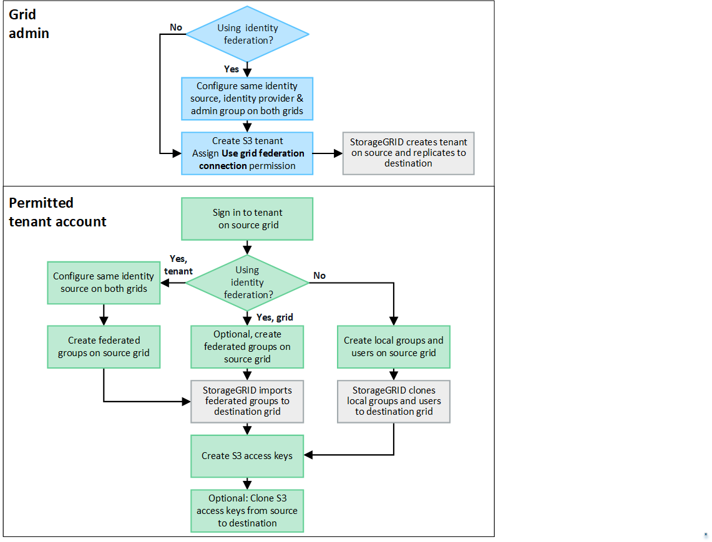

= What is account sync?
:icons: font
:imagesdir: ../media/

[.lead]
Account sync is the automatic and continuous replication of a tenant account, tenant groups, tenant users, and, optionally, S3 access keys among the StorageGRID systems in one or more link:grid-federation-overview.html[grid federation connections]. 

Account sync is required for link:grid-federation-what-is-cross-grid-replication.html[cross-grid replication]. Syncing account information among StorageGRID systems ensures that tenant users and groups can access the corresponding buckets and objects on any connected grid.

== Workflow for account sync

The workflow diagram shows the steps that grid administrators and permitted tenants will perform to set up account sync. These steps are performed after the link:grid-federation-create-connection.html[grid federation connection is configured].

== Grid admin workflow

The steps that grid admins perform depend on whether the StorageGRID systems in the link:grid-federation-overview.html[grid federation connection] use single sign-on (SSO) or identity federation.

=== [[account-sync-sso]]Configure SSO for account sync (optional)

If either StorageGRID system in the grid federation connection uses SSO, both grids must use SSO. Before creating the tenant accounts for grid federation, the grid admins for the tenant's source and destination grids must perform these steps.

.Steps

. Configure the same identity source for both grids. See link:using-identity-federation.html[Use identity federation].

. Configure the same SSO identity provider (IdP) for both grids. See link:how-sso-works.html[Configure single sign-on].

. link:managing-admin-groups.html[Create the same admin group] on both grids by importing the same federated group.
+
When you create the tenant, you will select this group to have the initial Root access permission for both the source and destination tenant accounts. 
+
NOTE: If this admin group doesn't exist on both grids before you create the tenant, the tenant isn't replicated to the destination.

=== [[account-sync-identity-federation]]Configure grid-level identity federation for account sync (optional)

If either StorageGRID system uses identity federation without SSO, both grids must use identity federation. Before creating the tenant accounts for grid federation, the grid admins for the tenant's source and destination grids must perform these steps.

.Steps

. Configure the same identity source for both grids. See link:using-identity-federation.html[Use identity federation].

. Optionally, if a federated group will have initial Root access permission for both the source and destination tenant accounts, link:managing-admin-groups.html[create the same admin group] on both grids by importing the same federated group.
+
NOTE: If you assign Root access permission to a federated group that doesn't exist on both grids, the tenant isn't replicated to the destination grid.

. If you don't want a federated group to have initial Root access permission for both accounts, specify a password for the local root user.

=== Create permitted S3 tenant account

After optionally configuring SSO or identity federation, a grid admin performs these steps to determine which tenants can replicate bucket objects to other StorageGRID systems.

.Steps
. Determine which grid you want to be the tenant's source grid for account sync operations.
+
The grid where the tenant is originally created is known as the tenant's _source grid_. The grid where the tenant is replicated is known as the tenant's _destination grid_. 

. On that grid, create a new S3 tenant account or edit an existing account.

. Assign the *Use grid federation connection* permission.
. If the tenant account will manage its own federated users, assign the *Use own identity source* permission.
+
If this permission is assigned, both the source and destination tenant accounts must configure the same identity source before creating federated groups. Federated groups added to the source tenant can't be synced to the destination tenant unless both grids use the same identity source.

. Select a specific grid federation connection.

. Save the new or modified tenant.
+
When a new tenant with the *Use grid federation connection* permission is saved, StorageGRID automatically creates a replica of that tenant on the other grid, as follows:

* Both tenant accounts have the same account ID, name, storage quota, and assigned permissions.
* If you selected a federated group to have Root access permission for the tenant, that group is cloned to the destination tenant. However, continuous syncing doesn't occur for federated groups and users. Only a one-time clone occurs.
* If you selected a local user to have Root access permission for the tenant, that user is synced to the destination tenant.

For details, refer to link:grid-federation-manage-tenants.html[Manage permitted tenants for grid federation].

== Permitted tenant account workflow

After a tenant with the *Use grid federation connection* permission is replicated to the destination grid, permitted tenant accounts can perform these steps to sync tenant groups, users, and S3 access keys.

.Steps

. Sign in to the tenant account on any connected grid.

. If permitted, configure identity federation on both the source and destination tenant accounts.

. Create groups and users on any connected grid.
+
When new groups or users are created on a tenant, StorageGRID automatically syncs them to the destination tenant. 

. Create S3 access keys.

. Optionally, sync S3 access keys from the source tenant to the destination tenant. 

For details about the permitted tenant account workflow and to learn how groups, users, and S3 access keys are synced, refer to link:../tenant/grid-federation-account-clone.html[Sync tenant groups and users].

