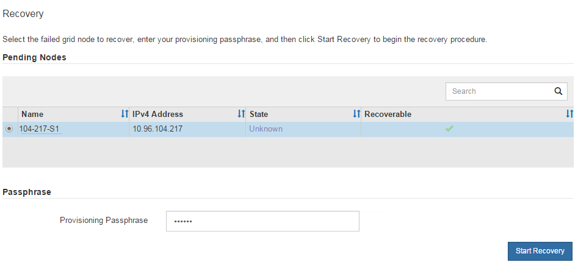

= Select Start Recovery to configure StorageGRID appliance Storage Node
:icons: font
:imagesdir: ../media/

[.lead]
You must select Start Recovery in the Grid Manager to configure an appliance Storage Node as a replacement for the failed node.

.Before you begin

* You are signed in to the Grid Manager using a link:../admin/web-browser-requirements.html[supported web browser].
* You have the link:../admin/admin-group-permissions.html[Maintenance or Root access permission].
* You have the provisioning passphrase.
* You have deployed a recovery appliance Storage Node.
* You have the start date of any repair jobs for erasure-coded data.

.Steps

. From the Grid Manager, select *Maintenance* > *Tasks* > *Node recovery*.
. Select the grid node you want to recover in the Pending Nodes list.
+
Nodes appear in the list after they fail, but you can't select a node until it has been reinstalled and is ready for recovery.

. Enter the *Provisioning passphrase*.
. Select *Start recovery*.
+

. Monitor the progress of the recovery in the Recovering Grid Node table.
+
* If the grid node reaches the "Waiting for manual steps" stage, you must link:../maintain/remounting-and-reformatting-appliance-storage-volumes.html[remount and reformat the appliance storage volumes manually].

* If the "Waiting for manual steps" message doesn't appear, it means the storage volumes have been automatically remounted and reformatted, and you can link:../maintain/restoring-object-data-to-storage-volume-for-appliance.html[restore object data to the volumes].

[NOTE]
====
At any point during the recovery, you can select *Reset* to start a new recovery. A dialog box appears, indicating that the node will be left in an indeterminate state if you reset the procedure.

If you want to retry the recovery after resetting the procedure, you must restore the appliance node to a pre-installed state by running `sgareinstall` on the node.
====