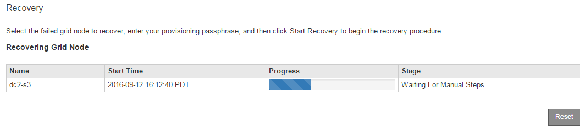

= Select Start Recovery to configure StorageGRID Storage Node
:icons: font
:imagesdir: ../media/

[.lead]
After replacing a Storage Node, you must select Start Recovery in the Grid Manager to configure the new node as a replacement for the failed node.

.Before you begin

* You are signed in to the Grid Manager using a link:../admin/web-browser-requirements.html[supported web browser].
* You have the link:../admin/admin-group-permissions.html[Maintenance or Root access permission].
* You have the provisioning passphrase.
* You have deployed and configured the replacement node.
* You have the start date of any repair jobs for erasure-coded data.

.About this task

If the Storage Node is installed as a container on a Linux host, you must perform this step only if one of these is true:

* You had to use the `--force` flag to import the node, or you issued `storagegrid node force-recovery _node-name_`
* You had to do a full node reinstall, or you needed to restore /var/local.

.Steps

. Log in to the primary Admin Node. If the primary Admin Node is unavailable, use a non-primary Admin Node, if one exists, and if it is designated as the Admin Node for the recovery procedure.
. From the Grid Manager, select *Maintenance* > *Tasks* > *Recovery*.
. Select the grid node you want to recover in the Pending Nodes list.
+
Nodes appear in the list after they fail, but you can't select a node until it has been reinstalled and is ready for recovery.

. Enter the *Provisioning Passphrase*.
. Click *Start Recovery*.
+
image::../media/4b_select_recovery_node.png[screenshot showing the Maintenance > Recovery page]

. Monitor the progress of the recovery in the Recovering Grid Node table.
+
* If the grid node reaches the "Waiting for manual steps" stage, you must link:../maintain/remounting-and-reformatting-storage-volumes-manual-steps.html[remount and reformat the storage volumes manually].

* If the "Waiting for manual steps" message doesn't appear, it means the storage volumes have been automatically remounted and reformatted, and you can link:../maintain/restoring-object-data-to-storage-volume.html[restore object data to the volumes].

. When the Storage Node reaches the "Waiting for Manual Steps" stage, go to link:remounting-and-reformatting-storage-volumes-manual-steps.html[Remount and reformat storage volumes (manual steps)].
+

* *VMware*: Delete the deployed virtual grid node. Then, when you are ready to restart the recovery, redeploy the node.
* *Linux*: Restart the node by running this command on the Linux host: `storagegrid node force-recovery _node-name_` 
====
// 2026-03-31, SGWS-34291