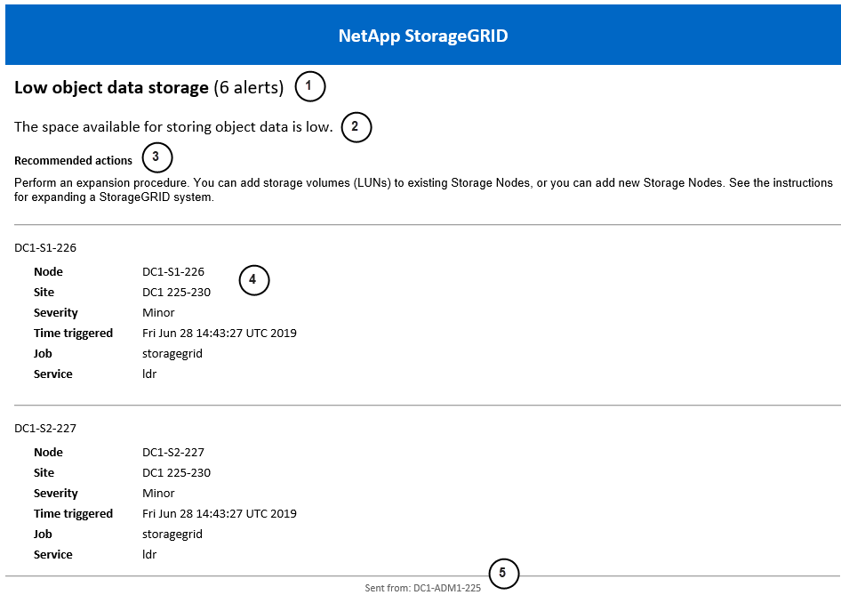

= Set up email notifications for StorageGRID alerts
:icons: font
:imagesdir: ../media/

[.lead]
If you want email notifications to be sent when alerts occur, you must provide information about your SMTP server. You must also enter email addresses for the recipients of alert notifications.

.Before you begin
* You are signed in to the Grid Manager using a link:../admin/web-browser-requirements.html[supported web browser].
* You have the link:../admin/admin-group-permissions.html[Manage alerts or Root access permission].
* You have link:../monitor/configure-email-server.html[configured an email server].

.About this task
If your StorageGRID deployment includes multiple Admin Nodes, the primary Admin Node is the preferred sender for alert notifications, AutoSupport packages, and SNMP traps and informs. If the primary Admin Node becomes unavailable, notifications are temporarily sent by other Admin Nodes. See link:../primer/what-admin-node-is.html[What is an Admin Node?].

.Steps
. Select *Alerts* > *Alerts email*.
+
The Alerts email page appears.

. Select the *Enable email for alerts* checkbox to indicate that you want notification emails to be sent when alerts reach configured thresholds.

. In the *Receive email by severity* section, select the radio button that indicates the types of alerts you want to be notified about.

. In the Sender section, specify a valid email address to use as the From address for alert notifications.
+
For example: `storagegrid-alerts@example.com`

 .. In the Recipients section, enter an email address for each email list or person who should receive an email when an alert occurs.
+
Select *Add recipient* to add recipients.

. Select *Save*.

== Information included in alert email notifications

After you configure the email server and enable email for alerts, email notifications are sent to the designated recipients when an alert is triggered, unless the alert rule is suppressed by a silence. Refer to link:silencing-alert-notifications.html[Silence alert notifications].

Email notifications include the following information:

[cols="1a,6a"options="header"]
|===
| Callout| Description

| 1
| The name of the alert, followed by the number of active instances of this alert.

| 2
| The description of the alert.

| 3
| Recommended actions for the alert.

| 4
| Details about each active instance of the alert, including the node and site affected, the alert severity, the UTC time when the alert rule was triggered, and the name of the affected job and service.

| 5
| The hostname of the Admin Node that sent the notification.
|===

== How alerts are grouped

To prevent an excessive number of email notifications from being sent when alerts are triggered, StorageGRID attempts to group multiple alerts in the same notification.

Refer to the following table for examples of how StorageGRID groups multiple alerts in email notifications.

[cols="1a,1a"options="header"]
|===
| Behavior| Example
| Each alert notification applies only to alerts that have the same name. If two alerts with different names are triggered at the same time, two email notifications are sent.
| 
* Alert A is triggered on two nodes at the same time. Only one notification is sent.
* Alert A is triggered on node 1, and Alert B is triggered on node 2 at the same time. Two notifications are sent--one for each alert.

| 
For a specific alert on a specific node, if the thresholds are reached for more than one severity, a notification is sent only for the most severe alert.

| 
* Alert A is triggered and the minor, major, and critical alert thresholds are reached. One notification is sent for the critical alert.

| 
The first time an alert is triggered, StorageGRID waits 2 minutes before sending a notification. If other alerts with the same name are triggered during that time, StorageGRID groups all of the alerts in the initial notification.​

| 
. Alert A is triggered on node 1 at 08:00. No notification is sent.
. Alert A is triggered on node 2 at 08:01. No notification is sent.
. At 08:02, a notification is sent to report both instances of the alert.

| 
If an another alert with the same name is triggered, StorageGRID waits 10 minutes before sending a new notification. The new notification reports all active alerts (current alerts that have not been silenced), even if they were reported previously.

| 
. Alert A is triggered on node 1 at 08:00. A notification is sent at 08:02.
. Alert A is triggered on node 2 at 08:05. A second notification is sent at 08:15 (10 minutes later). Both nodes are reported.

| 
If there are multiple current alerts with the same name and one of those alerts is resolved, a new notification is not sent if the alert reoccurs on the node for which the alert was resolved.

| 
. Alert A is triggered for node 1. A notification is sent.
. Alert A is triggered for node 2. A second notification is sent.
. Alert A is resolved for node 2, but it remains active for node 1.
. Alert A is triggered again for node 2. No new notification is sent because the alert is still active for node 1.

| 
StorageGRID continues to send email notifications once every 7 days until all instances of the alert are resolved or the alert rule is silenced.
| 
. Alert A is triggered for node 1 on March 8. A notification is sent.
. Alert A is not resolved or silenced. Additional notifications are sent on March 15, March 22, March 29, and so on.
|===

== Troubleshoot alert email notifications

Follow these steps to investigate and resolve the issue if the Email notification failure alert is triggered and you are not receiving:

* Test email server notifications
* StorageGRID alert emails
* Multi-admin verification (MAV) emails

.Before you begin
* You are signed in to the Grid Manager using a link:../admin/web-browser-requirements.html[supported web browser].
* You have the link:../admin/admin-group-permissions.html[Root access permission]. If you have the Manage alerts permission, you can view, but not edit, the email server configuration.

.Steps
. Verify your alert email settings.
 .. Verify that you have specified valid email addresses for the recipients.
 .. Select *Configuration* > *Email server* and verify that the Email (SMTP) server settings are correct.
. Check your spam filter, and make sure that the email was not sent to a junk folder.
. Ask your email administrator to confirm that emails from the sender address aren't being blocked.
. Check the following items relating to email transfer:
 .. Email server log monitoring: View the logs for the email server used by StorageGRID (*Configuration* > *Email server*). Search for relay errors, authentication errors, and other failures matching the time StorageGRID attempted to send an email.
 .. Non-delivery reports (bounce-backs): If emails are not received and StorageGRID does not report a failure, the issue might be a bounce-back. Configuring the "from" address to use a valid email address will make these bounce-back reply emails visible to you.
. Collect the log files for the Admin Node that is sending the emails. Review the /var/local/log/prometheus.log and /var/local/log/nms.log files for obvious issues you might be able to correct. If you are unable to resolve the issue contact technical support.
+
Technical support can use the information in the logs to help determine what went wrong. For example, the prometheus.log file might show an error when connecting to the server you specified.
+
Refer to link:collecting-log-files-and-system-data.html[Collect log files and system data].
