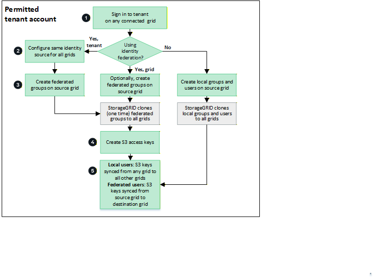

= Sync tenant groups and users
:icons: font
:imagesdir: ../media/

[.lead]
If a tenant was created or edited to use grid federation connections, that tenant is replicated from one StorageGRID system (the source tenant) to all other connected StorageGRID systems (the replica tenants). After the tenant has been replicated, tenant groups, users, and S3 access keys are synced across the connected grids.

The StorageGRID system where the tenant is originally created is the tenant's _source grid_. The tenant is replicated to one or more _destination grids_. The tenant accounts on all connected grids have the same account ID, name, description, storage quota, and assigned permissions, but the destination tenants don't initially have a root user password. For details, refer to link:../admin/grid-federation-what-is-account-clone.html[Learn about account sync for grid federation] and link:../admin/grid-federation-manage-tenants.html[Manage permitted tenants].

The syncing of tenant account information is required for link:../admin/grid-federation-what-is-cross-grid-replication.html[cross-grid replication] of bucket objects. Having the same tenant groups and users on all grids ensures you can access the corresponding buckets and objects on any connected grid.

== Tenant workflow for account sync

If your tenant account has the *Use grid federation connection* permission, review the workflow diagram to see the steps you will perform to sync groups, users, and S3 access keys.

These are the primary steps in the workflow:

.image:https://raw.githubusercontent.com/NetAppDocs/common/main/media/number-1.png[One] Sign in to tenant

[role="quick-margin-para"]
Sign in to the tenant account on any connected grid.

.image:https://raw.githubusercontent.com/NetAppDocs/common/main/media/number-2.png[Two] Optionally, configure identity federation

[role="quick-margin-para"]
*HOW DOES THIS CHANGE FOR 12.1?* If your tenant account has the *Use own identity source* permission to use federated groups and users, configure the same identity source (with the same settings) for the source and one or more destination tenant accounts. Federated groups and users can't be synced unless all grids are using the same identity source. For instructions, see link:using-identity-federation.html[Use identity federation]. 

.image:https://raw.githubusercontent.com/NetAppDocs/common/main/media/number-3.png[Three] Create groups and users

[role="quick-margin-para"]
You can create groups and users from any connected grid. When you add a new local group, StorageGRID automatically syncs it to all connected grids. Changes to local groups (edit, delete) are also continuously synced. Federated groups are synced once at creation.

[role="quick-margin-list"]
* If identity federation is configured for the entire StorageGRID system or for your tenant account, link:creating-groups-for-s3-tenant.html[create new tenant groups] by importing federated groups from the identity source.

[role="quick-margin-list"]
* If you aren't using identity federation,  link:creating-groups-for-s3-tenant.html[create new local groups] and then link:manage-users.html[create local users].

.image:https://raw.githubusercontent.com/NetAppDocs/common/main/media/number-4.png[Four] Create S3 access keys

[role="quick-margin-para"]
You can link:creating-your-own-s3-access-keys.html[create your own access keys] or to link:creating-another-users-s3-access-keys.html[create another user's access keys] on any grid to access buckets on all connected grids. 

.image:https://raw.githubusercontent.com/NetAppDocs/common/main/media/number-5.png[Five] Sync S3 access keys

[role="quick-margin-para"]
If you need to access buckets with the same access keys on all grids, create the access keys on one of the grids. For local users, the access keys are automatically synced by default. For federated users, you must create S3 access keys on the source grid for the keys to be synced to all destination grids.

== How are groups, users, and S3 access keys synced?

Review this section to understand how groups, users, and S3 access keys are synced across connected grids.

=== Local groups are continuously synced

After a tenant account is created and replicated to the destination grid, StorageGRID continuously syncs local groups across all connected grids. All changes to local groups—including create, edit, and delete operations—made on any grid are automatically replicated to all other connected grids.

Both the original group and its synced copies have the same access mode, group permissions, and S3 group policy. For instructions, refer to link:creating-groups-for-s3-tenant.html[Create groups for S3 tenant].

//image::../media/grid-federation-account-clone.png[image showing that local groups are synced between connected grids]

NOTE: Any users you select when you create a local group on a grid aren't included when the group is synced to other grids. For this reason, don't select users when you create the group. Instead, select the group when you create the users.

=== Local users are continuously synced

When you create a new local user on any connected grid, StorageGRID automatically syncs that user to all other connected grids. Subsequent changes—including edits, deletes, and password resets—are also continuously synced. The original user and its synced copies have the same full name, username, and *Deny access* setting. The same users on each grid also belong to the same groups. For instructions, refer to link:manage-users.html[Manage users].

//image::../media/grid-federation-local-user-clone.png[image showing that local users are synced between connected grids]

=== Federated groups are synced once at creation

Assuming the requirements for using account sync with link:../admin/grid-federation-what-is-account-clone.html#account-sync-sso[single sign-on] and link:../admin/grid-federation-what-is-account-clone.html#account-sync-identity-federation[identity federation] have been met, federated groups that you create (import) for the tenant on a grid are automatically synced to the tenant on all other connected grids.

Both groups have the same access mode, group permissions, and S3 group policy.

After federated groups are created for the source tenant and synced to other grids, federated users can sign in to the tenant on any connected grid. Subsequent changes to federated groups are not automatically synced across grids.

//image::../media/grid-federation-federated-group-clone.png[image showing that federated groups are synced from source grid to destination grid]

=== S3 access keys can be automatically or manually synced

By default, StorageGRID automatically syncs S3 access keys. For security, you can disable automatic syncing of S3 access keys for each tenant and have different keys for each tenant on each grid. 

To manage access keys on connected grids, you can do either of the following:

* If you don't need to use the same keys for each grid, you can disable automatic access key syncing and link:creating-your-own-s3-access-keys.html[create your own access keys] or link:creating-another-users-s3-access-keys.html[create another user's access keys] on each grid.

* *WHAT DO WE NEED TO SAY FOR 12.1?* If you need to use the same keys for each grid, you can create keys on one grid and then use the Tenant Manager API to manually link:../tenant/grid-federation-clone-keys-with-api.html[sync the keys] to the other grids.

//image::../media/grid-federation-s3-access-key.png[image showing that s3 access keys can be optionally synced between connected grids]

NOTE: When you sync S3 access keys for a federated user, both the user and the S3 access keys are synced to the destination tenants.

NOTE: S3 access keys owned by local users are continuously synced across connected grids, including when keys are deleted. S3 access keys owned by federated users are synced once at creation; subsequent changes, including deletes, are not replicated. You can enable or disable access key sync for each tenant connection.

=== Groups and users added to destination grid are synced

Changes made on any connected grid—including creating or importing groups and users—are automatically synced to all other connected grids.

//image::../media/grid-federation-account-not-cloned.png[image showing that changes on any grid are synced to all connected grids]

=== Edited or deleted local groups, users, and access keys are synced

Changes to local groups, local users, and S3 access keys owned by local users are continuously synced across all connected grids. Synced operations include edits, deletes, and password resets.

Changes to federated groups and S3 access keys owned by federated users are not synced after initial creation.

//image::../media/grid-federation-account-clone-edit-delete.png[image showing sync behavior for edits and deletes]

